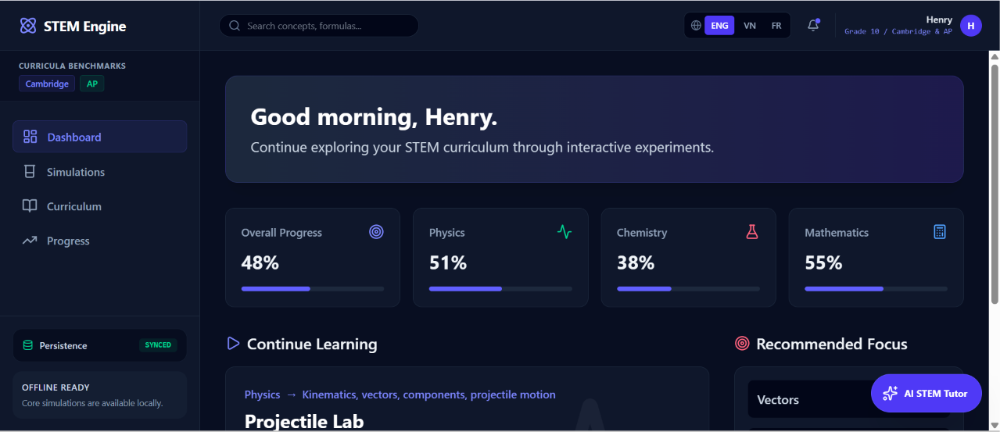
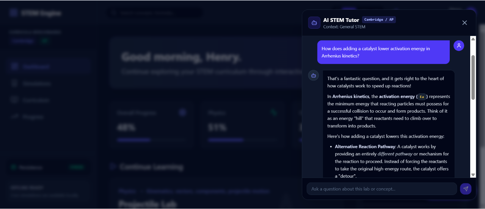
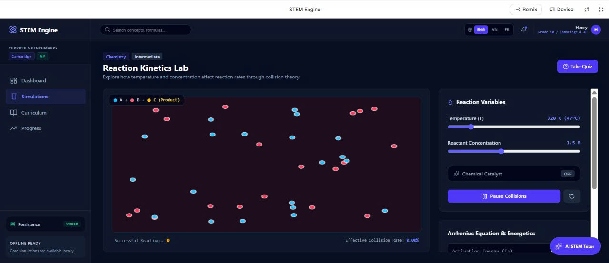
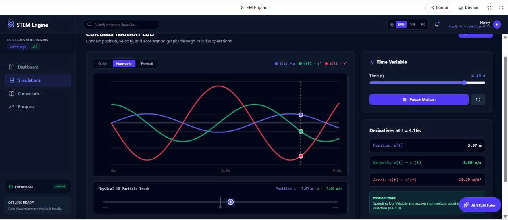
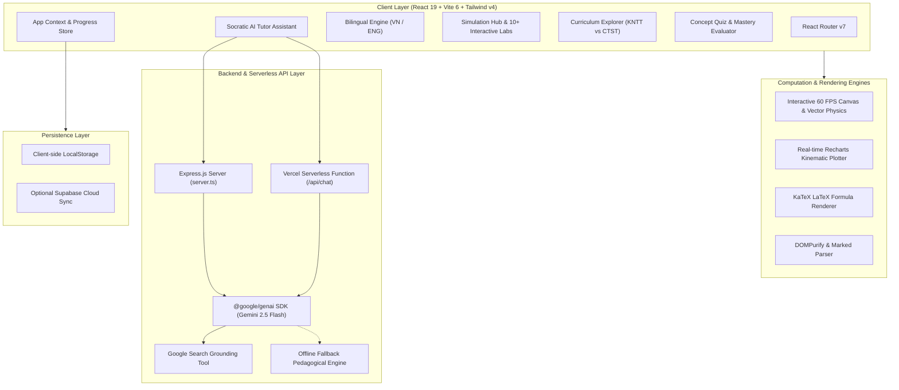

<div align="center">
  
</div>

# ⚛️ STEM-X: Interactive Academic STEM Simulation Engine

[](LICENSE)
[](https://www.typescriptlang.org/)
[](https://react.dev/)
[](https://vitejs.dev/)
[](https://tailwindcss.com/)
[](https://ai.google.dev/)
[](https://vercel.com/)

An interactive, high-precision STEM simulation engine and pedagogical learning platform built entirely around the **Vietnamese High School Grade 10 Physics curriculum (GDPT 2018)**, with synchronized dual-textbook mapping for *Kết nối tri thức với cuộc sống (KNTT)* and *Chân trời sáng tạo (CTST)*.

---

## 📸 Preview

<br />

| Lab Overview | Dynamic Simulation & Analysis |
| :---: | :---: |
|  |  |
| **Curriculum Cross-Mapping** | **Real-Time Data Visualization** |
|  |  |

---

## 🧪 Interactive Simulation Labs

### 1. 🚀 Projectile Motion Lab (`projectile-motion`)
* **Physics Domain:** 2D Kinematics, vector decomposition, launch angles, and gravitational trajectories.
* **Curriculum Alignment:** KNTT Bài 12 (Tr. 49) • CTST Bài 9 (Tr. 50).
* **Core Model:**
  $$x(t) = v_0 \cos(\alpha) \cdot t, \quad y(t) = h + v_0 \sin(\alpha) \cdot t - \frac{1}{2}gt^2$$
  $$L = \frac{v_0^2 \sin(2\alpha)}{g}, \quad H = \frac{v_0^2 \sin^2(\alpha)}{2g}$$

### 2. 🧱 Newton's Dynamics & Friction Lab (`newton-dynamics`)
* **Physics Domain:** Newton's Laws 1–3, free-body force analysis, kinetic friction, and inclined plane mechanics.
* **Curriculum Alignment:** KNTT Bài 14–20 (Tr. 60) • CTST Bài 10–13 (Tr. 55).
* **Core Model:**
  $$F_{\text{net}} = m \cdot a, \quad F_{\text{ms}} = \mu N = \mu m g \cos(\alpha), \quad a = g(\sin\alpha - \mu\cos\alpha)$$

### 3. 🎢 Mechanical Energy Conservation Lab (`energy-conservation`)
* **Physics Domain:** Kinetic energy, gravitational potential energy, conservative fields, simple pendulums, and roller coaster tracks.
* **Curriculum Alignment:** KNTT Bài 25–26 (Tr. 99) • CTST Bài 17 (Tr. 105).
* **Core Model:**
  $$W = W_đ + W_t = \frac{1}{2}mv^2 + mgh = \text{constant}$$

### 4. 💥 Momentum & Air Track Collision Lab (`momentum-collision`)
* **Physics Domain:** Linear momentum vectors, isolated systems, elastic vs. inelastic (soft) collisions with photogate timing.
* **Curriculum Alignment:** KNTT Bài 28–30 (Tr. 110) • CTST Bài 18–19 (Tr. 114).
* **Core Model:**
  $$\vec{p} = m\vec{v}, \quad m_1 v_1 + m_2 v_2 = (m_1 + m_2)v', \quad F\Delta t = \Delta p$$

### 5. 🔄 Uniform Circular Motion & Centripetal Force (`circular-motion`)
* **Physics Domain:** Angular velocity, tangential velocity, centripetal acceleration, and vehicle road-banking safety limits.
* **Curriculum Alignment:** KNTT Bài 31–32 (Tr. 120) • CTST Bài 20–21 (Tr. 126).
* **Core Model:**
  $$v = \omega r, \quad a_{\text{ht}} = \frac{v^2}{r} = \omega^2 r, \quad F_{\text{ht}} = m \frac{v^2}{r}, \quad v_{\text{max}} = \sqrt{\mu g r}$$

### 6. 🪢 Elastic Deformation & Hooke's Law Lab (`hooke-elasticity`)
* **Physics Domain:** Solid deformation, vertical spring-mass equilibrium, stiffness coefficient ($k$), and elastic energy.
* **Curriculum Alignment:** KNTT Bài 33 (Tr. 128) • CTST Bài 22–23 (Tr. 136).
* **Core Model:**
  $$F_{\text{dh}} = k \cdot |\Delta l|, \quad k \Delta l = mg, \quad W_{\text{dh}} = \frac{1}{2} k (\Delta l)^2$$

### 7. 📈 Displacement-Time & Error Analysis Lab (`displacement-time`)
* **Physics Domain:** 1D/2D displacement vs. distance, real-time $d-t$ kinematic slope interpretation, and experimental error propagation.
* **Curriculum Alignment:** KNTT Bài 3–7 (Tr. 15–34) • CTST Bài 3–4 (Tr. 16–28).
* **Core Model:**
  $$v = \frac{\Delta d}{\Delta t}, \quad \bar{A} = \frac{1}{n}\sum_{i=1}^n A_i, \quad \delta A = \frac{\Delta A}{\bar{A}} \times 100\%$$

### 8. ⚡ DC Electric Circuit & Ohm's Law Lab (`electric-circuit`)
* **Physics Domain:** DC circuit analysis, series and parallel topologies, branch currents, and Joule heating dissipation.
* **Curriculum Alignment:** KNTT & CTST Chuyên đề Mạch điện một chiều.
* **Core Model:**
  $$I = \frac{U}{R}, \quad P = UI = I^2 R = \frac{U^2}{R}, \quad \frac{1}{R_{\text{parallel}}} = \frac{1}{R_1} + \frac{1}{R_2}$$

### 9. 🌊 Mechanical Waves & Wave Interference Lab (`wave-interference`)
* **Physics Domain:** Sinusoidal wave propagation, wavelength, frequency, and coherent two-source interference fringes.
* **Curriculum Alignment:** KNTT & CTST Chuyên đề Sóng cơ học.
* **Core Model:**
  $$\lambda = v \cdot T = \frac{v}{f}, \quad \text{Constructive: } \Delta d = k\lambda, \quad \text{Destructive: } \Delta d = (k + 0.5)\lambda$$

### 10. 🪐 Orbital Mechanics Lab (`orbital-mechanics`)
* **Physics Domain:** Newtonian universal gravitation, orbital velocity, Keplerian motion, and gravitational potential wells.
* **Core Model:**
  $$F_g = G \frac{M m}{r^2}, \quad v_{\text{orbit}} = \sqrt{\frac{GM}{r}}$$

---

## 🏛️ System Architecture



---

## 🌟 Key Architecture Highlights

* **Dual Vietnamese Curriculum Mapping Engine (GDPT 2018):** Synchronized side-by-side mapping for all Grade 10 Physics chapters between the two official textbook series *Kết nối tri thức với cuộc sống (KNTT)* and *Chân trời sáng tạo (CTST)* with exact textbook pages, lesson IDs, and figures. The platform does not support Cambridge (IGCSE/A-Level) or AP curricula.
* **Socratic AI Tutor with Gemini 2.5 Flash:** Context-injected AI tutor powered by `@google/genai` that ingests live simulation variables, formulas, and textbook references to guide students using Socratic inquiry. Includes an offline heuristic fallback mode when API keys are not provided.
* **Interactive 60 FPS Physics Engine:** Custom HTML5 Canvas and React state loop delivering real-time variable manipulation, trajectory trace paths, animated force vectors, and photogate sensor measurements.
* **Mastery Analytics & Anti-Double Counting:** Real-time concept mastery tracking, quiz scoring with textbook justification, and persistent progress logging.
* **Full Bilingual Internationalization (i18n):** Instant dynamic language switching between Vietnamese (`VN`) and English (`ENG`) across all interfaces, formulas, quizzes, and AI responses.
* **Dual Deployment Ready:** Seamlessly runs as a unified Node.js/Express server (via `server.ts` & `esbuild`) or as a decoupled static Single-Page Application (SPA) with Vercel Serverless Functions (`api/chat.ts`).

---

## 🗂️ Project Directory Structure

```text
stemx/
├── api/                        # Vercel Serverless Functions
│   ├── chat.ts                 # AI Tutor endpoint with Gemini 2.5 Flash
│   └── health.ts               # Health check endpoint
├── public/                     # Static assets & preview screenshots
├── src/
│   ├── components/
│   │   ├── ai/                 # AI Tutor UI assistant & chat drawer
│   │   ├── common/             # LaTeX renderer (KaTeX) & Markdown components
│   │   ├── curriculum/         # KNTT & CTST Curriculum Explorer
│   │   ├── dashboard/          # Student dashboard & recommended focus
│   │   ├── layout/             # Responsive TopBar, Sidebar, and App Shell
│   │   ├── progress/           # Mastery progress & learning activity log
│   │   ├── quiz/               # Multi-question concept quizzes & evaluations
│   │   ├── simulations/        # 10+ STEM interactive physics & math labs
│   │   └── theory/             # Structured lesson notes & formulas
│   ├── context/
│   │   └── AppContext.tsx      # Global state, theme, language, and progress
│   ├── data/
│   │   ├── curriculumData.ts   # 24+ Grade 10 aligned chapters & quizzes
│   │   ├── mockData.ts         # Simulation metadata & formula registry
│   │   └── physicsTheoryData.ts# Detailed theoretical models & formulas
│   ├── lib/
│   │   ├── aiTutor.ts          # Client-side AI API caller & prompt builder
│   │   └── supabaseClient.ts   # Supabase client integration (optional)
│   ├── types/                  # TypeScript interface declarations
│   ├── App.tsx                 # Route declarations & layout provider
│   ├── i18n.ts                 # Vietnamese & English dictionary
│   ├── index.css               # Tailwind CSS v4 styling rules
│   └── main.tsx                # Application bootstrap entry point
├── server.ts                   # Express + Vite development & production server
├── vercel.json                 # Vercel routing & serverless configuration
├── vite.config.ts              # Vite 6 + React + Tailwind v4 bundler config
└── package.json                # Dependencies, scripts, and build targets
```

---

## 🚀 Getting Started Locally

### Prerequisites
* **Node.js**: `>= 18.0.0`
* **npm**: `>= 9.0.0`

### Step-by-Step Installation

1. **Clone the repository:**
   ```bash
   git clone https://github.com/Henrycoding-design/STEMX.git
   cd STEMX
   ```

2. **Install dependencies:**
   ```bash
   npm install
   ```

3. **Configure Environment Variables:**
   Create a `.env` file in the project root:
   ```env
   # Server Configuration
   PORT=3000

   # AI Tutor Integration (Optional - Fallback offline tutor activates if omitted)
   GEMINI_API_KEY=your_gemini_api_key_here

   # Cloud Persistence (Optional)
   VITE_SUPABASE_URL=https://your-project.supabase.co
   VITE_SUPABASE_ANON_KEY=your_supabase_anon_key
   ```

4. **Start the Development Server:**
   ```bash
   npm run dev
   ```
   Open [http://localhost:3000](http://localhost:3000) in your browser.

5. **Type Check & Lint:**
   ```bash
   npm run lint
   ```

6. **Build for Production:**
   ```bash
   npm run build
   ```

---

## ☁️ Deployment

### 1. Vercel (Recommended)
This repository includes a preconfigured `vercel.json` optimized for Vite SPAs and serverless functions in `/api`:
1. Connect the repository to your [Vercel Dashboard](https://vercel.com).
2. Set Framework Preset to **Vite**.
3. Add environment variables (`GEMINI_API_KEY`, etc.) in the Vercel project settings.
4. Deploy!

### 2. Node.js / Docker / Render
The application can run as a standalone full-stack Node.js server:
```bash
npm run build
npm run start
```

---

## 📜 License

This project is open-source and licensed under the [MIT License](./LICENSE).