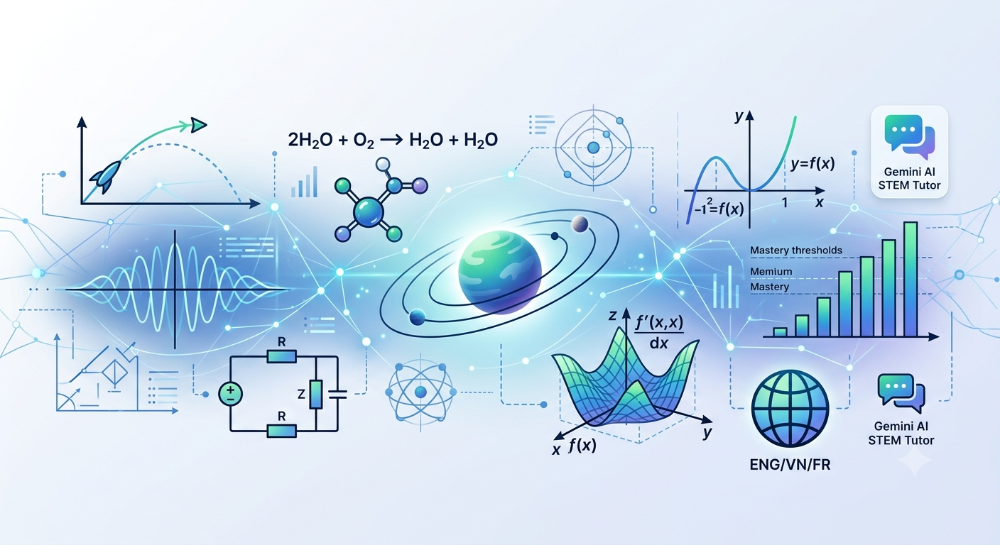

<div align="center">



# Interactive Academic STEM Simulation Engine

[](LICENSE)
[](https://www.typescriptlang.org/)
[](https://react.dev/)
[](https://vitejs.dev/)
[](https://vercel.com/)

*A high-precision, interactive STEM simulation engine mapped to Cambridge (IGCSE & A-Level) and College Board (AP) benchmarks.*

[Live Demo](#-deployment) • [Lab Modules](#-interactive-lab-modules) • [Getting Started](#%EF%B8%8F-getting-started-locally)

</div>

---

## 📖 Overview

The **Interactive Academic STEM Simulation Engine** is a web platform designed for dual-curriculum exploration across Physics, Chemistry, and Mathematics. It bridges theoretical principles with real-time computational visualization, allowing students and educators to manipulate variables, observe real-time derivatives, and evaluate system states against standardized academic benchmarks.

---

## 🧪 Interactive Lab Modules

### 1. 🚀 Projectile Lab
Explores kinematics, vector decomposition, launch height, and atmospheric drag.
* **Core Model:** Drag force calculation:

$$F_d = \frac{1}{2}\rho v^2 C_d A$$

---

### 2. 🌊 Wave Interference Lab
Simulates wave superposition, phase alignment, and two-source interference patterns.
* **Core Model:** Path difference calculation ($\Delta d = |S_1 P - S_2 P|$) for constructive vs. destructive wave node determination.

---

### 3. 📈 Function & Transformation Lab
Visualizes polynomial and trigonometric function transformations along coordinate axes.
* **Core Model:** Generalized function transformation:

$$g(x) = a \cdot f(b(x - c)) + d$$

---

### 4. ⚗️ Chemical Equilibrium Lab
Demonstrates Le Chatelier’s principle during pressure, volume, and thermal shifts using the Haber-Bosch process.
* **Core Model:** Dynamic tracking of reaction quotient ($Q_c$) against equilibrium constant ($K_c$).

---

### 5. ⚡ Electric Circuit Lab
Interactive circuit builder covering Series and Parallel topologies with live node analysis.
* **Core Model:** Ohm's Law ($V = IR$) and Joule heating dissipation ($P = I^2 R$).

---

### 6. 🪐 Orbital Mechanics Lab
Simulates planetary orbits, Kepler's laws, and gravitational potential wells.
* **Core Model:** Newtonian universal gravitation:

$$F_g = \frac{G M m}{r^2}$$

---

### 7. ⏱️ Reaction Kinetics Lab
Models collision theory, activation energy barriers, and Maxwell-Boltzmann molecular distributions.
* **Core Model:** Arrhenius rate equation:

$$k = A e^{-\frac{E_a}{RT}}$$

---

### 8. 📐 Calculus & Motion Lab
Provides real-time numerical differentiation connecting cinematic motion curves.
* **Core Model:** Instantaneous velocity $v(t) = s'(t)$ and acceleration $a(t) = v'(t)$.

---

## ✨ Core Architecture Features

* **Dual-Curriculum Synchronization:** Mapped directly to Cambridge (IGCSE 0625, A-Level 9702/9709) and College Board (AP Physics 1/2/C, AP Chemistry, AP Calculus AB/BC) competencies.
* **Dynamic Grading & Mastery Analytics:** Real-time problem evaluation engine featuring double-counting protection, score tracking, and threshold mastery indicators.
* **Multilingual Engine:** Real-time internationalization support for English (`ENG`), Vietnamese (`VN`), and French (`FR`).
* **Socratic AI Tutor Integration:** Context-aware tutoring widget powered by Google Gemini API with fallback offline heuristic responses.
* **Dual Persistence Layer:** High-speed client-side storage adapter with optional cloud synchronization via Supabase.

---

## 🛠️ Getting Started Locally

### Prerequisites
* **Node.js**: `>=18.0.0`
* **npm**: `>=9.0.0`

### Step-by-Step Setup

1. **Clone the repository:**
```bash
git clone [https://github.com/username/repository-name.git](https://github.com/username/repository-name.git)
cd repository-name

```

1. **Install dependencies:** 
```bash 
npm install 
```

2. **Configure Environment Variables:** 
Copy `.env.example` to create your local `.env` configuration: 
```bash 
cp .env.example .env 
``` 

*Fill in your optional integration keys:* 
```bash
GEMINI_API_KEY=your_gemini_api_key_here 
VITE_SUPABASE_URL=https://your-project.supabase.co 
VITE_SUPABASE_ANON_KEY=your_supabase_anon_key 
```

3. **Launch Development Server:** 
```bash 
npm run dev 
``` 
Navigate to `http://localhost:3000` in your web browser.

4. **Type Checking & Linting:** ```bash npm run lint ```

5. **Production Build:** ```bash npm run build ```

## ☁️ Deployment Guides

| Platform | Deployment Type | Target Config |
| --- | --- | --- |
| **Vercel** | Edge Network / Static SPA | Uses root `vercel.json` with fallback rewriting |
| **Render** | Web Service / Node.js | Build: `npm install && npm run build` |

### Deploying to Vercel

This repository contains a fully configured `vercel.json` optimized for Vite SPAs.

1. Import the repository in your Vercel Dashboard.
2. Select **Vite** as the Framework Preset.
3. Keep default settings (`Build Command: npm run build`, `Output Directory: dist`).
4. Add environment variables if utilizing Gemini or Supabase integrations.

## 📄 License

This project is licensed under the MIT License - see the [LICENSE](./LICENSE) file for details.